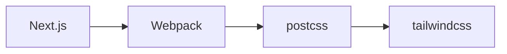

<TOCInline toc={props.toc} />

## What is Tailwind CSS?

Tailwind CSS is a utility-first CSS framework that provides a predefined set of classes to style HTML elements using a convention-based approach. Instead of writing custom CSS, you apply these classes directly in your markup, making styling more efficient and consistent.

At compile time, Tailwind generates only the CSS classes that are actually used in the HTML, minimizing the final CSS file size and improving performance. This eliminates the need to manually write and maintain custom styles while leveraging a well-structured design system.

As a design language, Tailwind CSS enforces consistency by defining global design rules for themes, spacing, typography, and colors, ensuring a cohesive look across applications.

## Usage

When integrating Tailwind CSS into a project, the process follows these steps:

1. **Install Tailwind CSS** as a development dependency:

   ```bash
   npm install -D tailwindcss
   ```

2. **Initialize the configuration file:**

   ```bash
   npx tailwindcss init
   ```

   This creates `tailwind.config.js`, where you define paths to your source files, customize themes, and extend functionality with plugins.

   You may config `tailwind.config.js` to scan relevant files:

   ```js
   module.exports = {
     content: [
       './app/**/*.{js,ts,jsx,tsx}',
       './pages/**/*.{js,ts,jsx,tsx}',
       './components/**/*.{js,ts,jsx,tsx}',
     ],
     theme: {
       extend: {},
     },
     plugins: [],
   }
   ```

3. **Create a CSS entry file** (e.g., `styles.css`) and import Tailwind’s core directives:

   ```css
   @tailwind base;
   @tailwind components;
   @tailwind utilities;
   ```

4. **Use Tailwind classes** in your HTML or JSX components.

5. **Run Tailwind CLI to generate the final CSS file:**

   ```bash
   npx tailwindcss -i ./styles.css -o ./dist/output.css --watch
   ```

6. **Include the compiled CSS file** in your project:
   ```html
   <link rel="stylesheet" href="./dist/output.css" />
   ```

## What Happens at Compile Time in Tailwind CSS?

At compile time, Tailwind scans your project for class names, removes unused styles (purging), and generates an optimized CSS file with only the necessary styles.

> [!Note] Why Does Tailwind Rely on PostCSS?  
> When using tailwindcss in other web frameworks like Next.js, we often see instructions to install `postcss autoprefixer` as well.
>
> ```sh
>   npm install -D tailwindcss postcss autoprefixer
> ```
>
> Tailwind CSS doesn’t process styles directly; instead, it leverages **PostCSS**, a tool for transforming CSS with JavaScript-based plugins. The **@tailwind directives** (e.g., `@tailwind base;`) are processed by PostCSS, which expands them into full styles.



### **Tailwind’s Relationship with PostCSS**

1. **Tailwind Directives**  
   The `@tailwind` directive tells PostCSS to inject Tailwind’s prebuilt styles into the final CSS output. Without these directives, Tailwind wouldn’t apply base styles or utilities.

2. **PostCSS Processing Pipeline**  
   When Webpack or Vite builds the project, PostCSS executes the Tailwind plugin to parse `@tailwind` rules and replace them with the actual CSS definitions.

   > [!TIP] Why Not Process Tailwind Directly?
   > Since Tailwind extends CSS dynamically, PostCSS provides a structured way to transform styles before they reach the browser. Webpack or Vite invokes PostCSS as part of the build process, ensuring that Tailwind’s styles are optimized alongside other CSS transformations.

### **How Next.js Hooks Up Tailwind CSS in Its Workflow**

Next.js integrates with Tailwind CSS **at build time** using PostCSS. Here's the process:

1. **Next.js Compiles Files with Webpack**

   - Webpack processes `.js`, `.ts`, `.jsx`, `.tsx`, and CSS files.
   - CSS imports (e.g., `import './globals.css'`) trigger PostCSS processing.

2. **PostCSS Processes Tailwind Directives**

   - The `postcss-loader` runs `@tailwind base`, `@tailwind components`, and `@tailwind utilities`.
   - The Tailwind JIT engine scans files specified in `tailwind.config.js` and generates only the used CSS.

3. **CSS is Minified for Production**
   - Next.js applies tree-shaking to remove unused styles.
   - The final CSS is included in a `<style>` tag or an external CSS file via `<link>`.

## How does Tailwind CSS work in Pseudocode

- **Tailwind scans files** to find utility classes and generates only the required CSS.
- **JIT engine updates CSS in real time** when new classes appear.
- **Utility classes are generated dynamically** based on naming conventions.
- **Unused styles are purged in production** to keep CSS minimal.

1. Tailwind CSS Workflow in Pseudocode

```python
START TailwindCSS

# Step 1: Load Configuration
config = loadConfig("tailwind.config.js")

# Step 2: Scan Content Files for Utility Classes
contentFiles = scanFiles(config.content)
usedClasses = extractClasses(contentFiles)

# Step 3: Process Directives in the Input CSS
IF "@tailwind base" is found THEN
    insertBaseStyles()

IF "@tailwind components" is found THEN
    insertComponentStyles(config.components)

IF "@tailwind utilities" is found THEN
    insertUtilityStyles(usedClasses)

# Step 4: Apply Custom Plugins
FOR each plugin in config.plugins:
    runPlugin(plugin)

# Step 5: Optimize and Output CSS
IF mode == "production":
    removeUnusedCSS()
    minifyCSS()

writeOutputCSS("dist/output.css")
END TailwindCSS
```

2. Tailwind JIT Compilation Core Logic

```python
START JIT Engine

# Monitor file changes in real-time
WHILE (watchingFiles)
    IF (fileChanged)
        newClasses = extractClasses(file)
        updateCSS(newClasses)

    IF (newClassNotExists)
        generateUtilityRule(newClass)
        addToCSSOutput(newClass)

writeOutputCSS()
END JIT Engine
```

3. Core Utility Class Generation

```python
FUNCTION generateUtilityRule(className)
    rule = ""
    IF className STARTS WITH "bg-"
        rule = "background-color: " + getColor(className)
    ELSE IF className STARTS WITH "text-"
        rule = "color: " + getColor(className)
    ELSE IF className STARTS WITH "flex"
        rule = "display: flex"
    ELSE IF className STARTS WITH "grid"
        rule = "display: grid"
    ELSE
        rule = lookupPredefinedStyle(className)

    RETURN rule
END FUNCTION
```

4. Removing Unused CSS in Production

```python
FUNCTION removeUnusedCSS()
    FOR each cssRule in outputCSS
        IF cssRule.className NOT IN usedClasses
            remove(cssRule)
    END FOR
END FUNCTION
```

## How PostCSS work in Pseudocode

- **PostCSS parses CSS into an AST**, allowing plugins to transform it.
- **Each plugin modifies the AST**, like Tailwind inserting utility classes or Autoprefixer adding vendor prefixes.
- **After processing, PostCSS converts the AST back into a CSS file** for the final output.
- **Plugins like Tailwind scan content files dynamically** and generate only the necessary styles.

1. PostCSS Core Processing Workflow

```python
START PostCSS

# Step 1: Load Configuration and Input CSS
config = loadConfig("postcss.config.js")
inputCSS = readFile("styles.css")

# Step 2: Parse CSS into an Abstract Syntax Tree (AST)
AST = parseCSS(inputCSS)

# Step 3: Apply Each Plugin in Order
FOR each plugin in config.plugins:
    AST = plugin.process(AST)

# Step 4: Serialize AST Back to CSS
outputCSS = generateCSS(AST)

# Step 5: Write to Output File
writeFile("dist/output.css", outputCSS)

END PostCSS
```

2. Plugin Processing Mechanism

```python
FUNCTION plugin.process(AST)
    FOR each node in AST:
        IF plugin.shouldTransform(node):
            plugin.transform(node)
    END FOR
    RETURN AST
END FUNCTION
```

3. How Tailwind CSS Works as a PostCSS Plugin

```python
FUNCTION tailwindPlugin.process(AST)
    # Detect and replace Tailwind directives
    FOR each node in AST:
        IF node.type == "@tailwind":
            IF node.name == "base":
                insertBaseStyles(AST)
            ELSE IF node.name == "components":
                insertComponentStyles(AST)
            ELSE IF node.name == "utilities":
                insertUtilityStyles(AST)
            removeNode(AST, node)

    # Generate and inject utility classes dynamically
    usedClasses = extractClassesFromContent()
    FOR each class in usedClasses:
        IF not existsInAST(class):
            AST.append(generateUtilityRule(class))

    RETURN AST
END FUNCTION
```

4. AST Parsing and Transformation Example

```python
# Example AST Node Transformation
IF node.type == "rule" AND node.selector CONTAINS "text-":
    colorValue = extractColorFromClass(node.selector)
    node.declarations.append({"property": "color", "value": colorValue})
```

5. Optimizing and Minifying CSS (Example of PostCSS Plugin)

```python
FUNCTION minifyPlugin.process(AST)
    FOR each rule in AST:
        removeWhitespace(rule)
        shortenPropertyNames(rule)
    RETURN AST
END FUNCTION
```

## Cascade layers

**Cascade Layers** (`@layer`) in Tailwind CSS help organize styles into structured layers, allowing finer control over style precedence. Tailwind provides three built-in layers:

1. **Base Layer** (`@layer base`)

   - Contains low-level styles such as resets and default element styles.
   - Equivalent to traditional **CSS resets** or **global styles**.

2. **Components Layer** (`@layer components`)

   - Holds reusable class-based styles, like buttons or cards.
   - Ensures these styles override base styles but remain customizable.

3. **Utilities Layer** (`@layer utilities`)
   - Contains utility classes (e.g., `text-center`, `bg-red-500`).
   - Has the highest specificity and overrides base and component styles.

Tailwind processes these layers in the following order:

1️⃣ **Base** (Lowest Priority)  
2️⃣ **Components**  
3️⃣ **Utilities** (Highest Priority)

Since **later layers override earlier ones**, utility classes can always take precedence over default styles and custom components.

**Example: Customizing with Layers**

```css
@tailwind base;
@tailwind components;
@tailwind utilities;

@layer base {
  h1 {
    @apply text-2xl font-bold;
  }
}

@layer components {
  .btn {
    @apply rounded bg-blue-500 px-4 py-2 text-white;
  }
}

@layer utilities {
  .text-shadow {
    text-shadow: 2px 2px 4px rgba(0, 0, 0, 0.1);
  }
}
```
