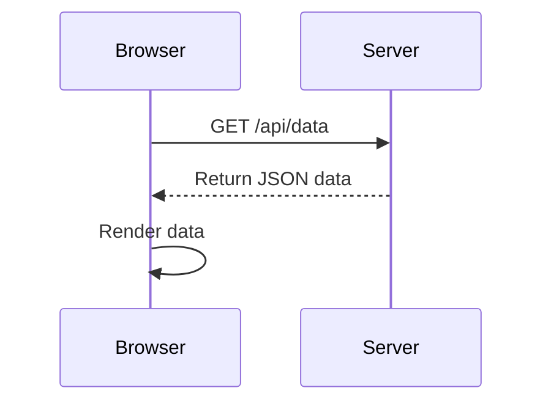
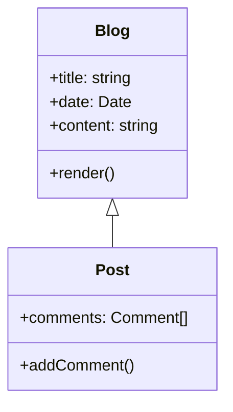
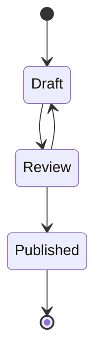
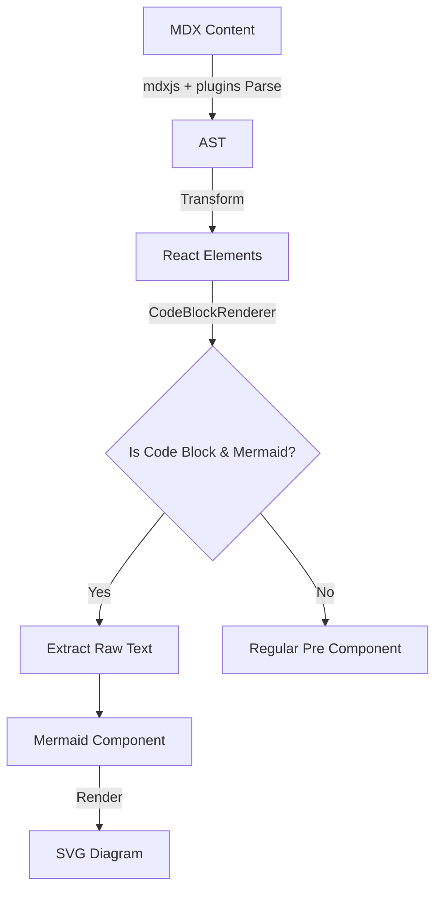

<TOCInline toc={props.toc} toHeading={2} exclude="Introduction" />

GitHub added support for Mermaid diagrams in markdown files, but this feature isn't natively available in MDX. When adding Mermaid diagram support to an MDX blog, there are two main approaches:

1. **Client-side rendering** - Using a browser-based component to render diagrams
2. **Server-side rendering** - Pre-rendering diagrams (into svg, png, or whatever format) during build time

Either way, the underlying library to render the merimaid text code to visual diagrams (in the form of svg) is [mermaid.js](https://mermaid.js.org/intro/).
It traverse the text code, parses it to AST, and then renders the AST to svg.

For this blog, I chose the client-side approach. Here's why:

ContentLayer transforms MDX files to JSON at build time on the server (Node.js environment). While we could theoretically transform Mermaid code to SVGs during this step, there are significant limitations:

- Many transformation libraries require Puppeteer or Playwright, which in turn require a headless browser.
- These dependencies aren't supported in serverless environments like Vercel.
- The transformation process is resource-intensive.

The client-side approach offers several advantages:

- No server-side dependencies required
- Works seamlessly in serverless environments
- Offloads rendering work to the client browser
- Simple implementation using React components

The main challenge was preserving the Mermaid code blocks through ContentLayer's MDX-to-JSON transformation. ContentLayer converts the MDX into an AST (Abstract Syntax Tree), which can lose the original mermaid text code. Our solution extracts the Mermaid code blocks and passes them directly to a client-side component for rendering.

This post walks through implementing Mermaid diagram support in a Next.js blog using MDX and ContentLayer, with working examples to demonstrate the results.

## Implementation Steps

Here's how I added Mermaid support to my blog:

1. Install Dependencies

```bash
yarn add mermaid
```

2. Create Mermaid Component

Create a client-side [Mermaid component](https://github.com/xianminx/xianminx.github.com/blob/main/components/Mermaid.tsx) that handles the rendering of diagrams:

```typescript
// components/Mermaid.tsx
'use client'

import { useEffect, useRef, useState } from 'react'
import mermaid from 'mermaid'

// Module-level initialization flag
let mermaidInitialized = false

const initializeMermaid = () => {
  if (!mermaidInitialized) {
    mermaid.initialize({
      startOnLoad: true,
      theme: 'default',
      securityLevel: 'loose',
      fontFamily:
        'ui-sans-serif,system-ui,-apple-system,BlinkMacSystemFont,Segoe UI,Roboto,Helvetica Neue,Arial,Noto Sans,sans-serif',
    })
    mermaidInitialized = true
  }
}

interface ErrorDisplayProps {
  error: Error | string
  code: string
}

const ErrorDisplay = ({ error, code }: ErrorDisplayProps) => (
  <div className="overflow-hidden rounded-lg border border-red-200">
    <div className="border-b border-red-200 bg-red-50 px-4 py-2">
      <span className="mr-2 inline-block text-red-500">⚠️</span>
      <span className="text-sm font-medium text-red-700">
        {typeof error === 'string' ? error : error.message || 'Failed to render diagram'}
      </span>
    </div>
    <div className="bg-gray-50 p-4">
      <pre className="language-mermaid overflow-x-auto text-sm">{code}</pre>
    </div>
  </div>
)

interface MermaidProps {
  chart: string
}

const Mermaid = ({ chart }: MermaidProps) => {
  const [svg, setSvg] = useState<string>('')
  const [error, setError] = useState<Error | string | null>(null)

  useEffect(() => {
    // Initialize mermaid once for the entire application
    initializeMermaid()

    if (typeof chart === 'string') {
      try {
        // Generate a unique ID for this diagram
        const id = `mermaid-${Math.random().toString(36).substr(2, 9)}`

        mermaid.render(id, chart.trim()).then(
          ({ svg }) => {
            setError(null)
            setSvg(svg)
          },
          (error) => {
            console.error('Mermaid rendering failed:', error)
            setError(error)
            setSvg('')
          }
        )
      } catch (error) {
        console.error('Mermaid error:', error)
        setError(error instanceof Error ? error : 'Failed to render diagram')
        setSvg('')
      }
    }
  }, [chart])

  if (error) {
    return <ErrorDisplay error={error} code={chart} />
  }

  return <div className="mermaid-chart my-4" dangerouslySetInnerHTML={{ __html: svg }} />
}

export default Mermaid
```

3. Create CodeBlockRenderer

We created a mdx component to handle different types of code blocks, including Mermaid diagrams:

```tsx filename="CodeBlockRenderer.tsx"
// components/CodeBlockRenderer.tsx
'use client'

import type { ReactNode } from 'react'
import Pre from 'pliny/ui/Pre'
import Mermaid from './Mermaid'

const extractTextFromChildren = (children: ReactNode): string => {
  if (typeof children === 'string') return children
  if (Array.isArray(children)) return children.map(extractTextFromChildren).join('')
  if (children && typeof children === 'object' && 'props' in children) {
    return extractTextFromChildren(children.props.children)
  }
  return String(children || '')
}

const CodeBlockRenderer = ({ children, ...props }) => {
  if (children?.props?.className?.includes('language-mermaid')) {
    const rawText = extractTextFromChildren(children.props.children)
    return <Mermaid chart={rawText.trim()} />
  }
  return <Pre {...props}>{children}</Pre>
}

export default CodeBlockRenderer
```

4. Update MDX Components

We updated our MDX components configuration to use the CodeBlockRenderer:

```typescript
// components/MDXComponents.tsx
import CodeBlockRenderer from './CodeBlockRenderer'

export const components: MDXComponents = {
  pre: CodeBlockRenderer,
  // ... other components
}
```

5. Configure ContentLayer

Finally, we configured ContentLayer to ignore Mermaid code blocks in syntax highlighting:

```typescript
// contentlayer.config.ts
export default makeSource({
  contentDirPath: 'data',
  documentTypes: [Blog, Authors],
  mdx: {
    rehypePlugins: [
      // ... other plugins
      [
        rehypePrismPlus,
        {
          defaultLanguage: 'js',
          ignoreMissing: true,
          ignore: ['mermaid'],
        },
      ],
    ],
  },
})
```

## Example Diagrams

### Sequence Diagram



### Class Diagram



### State Diagram



## How It Works

The process of rendering Mermaid diagrams in MDX works like this:



With these changes, our blog now supports Mermaid diagrams directly in MDX files. This makes it easy to create and maintain technical documentation with rich diagrams that are version-controlled alongside the content.

## Appendix

When running in a Node.js environment, many Mermaid-related libraries rely on headless browsers like Puppeteer or Playwright to generate SVG diagrams. Here are some notable examples:

- The official [mermaid-cli](https://github.com/mermaid-js/mermaid-cli/blob/master/src/index.js) tool leverages Puppeteer to convert Mermaid syntax into SVG output
- [mdx-mermaid](https://github.com/sjwall/mdx-mermaid) processes Mermaid code blocks during compilation using Puppeteer to pre-generate SVGs
- The [mermaid.ink](https://github.com/jihchi/mermaid.ink) service utilizes Puppeteer to render diagrams as SVG images
- [rehype-mermaid](https://github.com/remcohaszing/rehype-mermaid) works in both Node.js and browser environments - in Node it uses Playwright via the `mermaid-isomorphic` library to generate SVGs

This approach of using headless browsers is common because it allows these tools to leverage the full Mermaid rendering capabilities in a Node environment where the DOM isn't normally available.

### mermaid.js internal

The [mermaid.js documentation](https://mermaid.js.org/intro/getting-started.html#requirements-for-the-mermaid-api) outlines the steps needed to integrate mermaid diagrams in browser-based applications. The process involves three main steps:

First, you need to include the mermaid.js library in your web page. Next, you initialize the library by invoking `mermaid.initialize()` with your desired configuration options. Finally, you can create diagrams by calling `mermaid.render()` with your diagram definition.

```html
<script src="https://cdn.jsdelivr.net/npm/mermaid/dist/mermaid.min.js"></script>
<script>
  mermaid.initialize({
    startOnLoad: true,
  })
</script>

<div class="mermaid">graph TD A[Start] --> B[Install Dependencies]</div>
```

When used in a web page, the mermaid.js library automatically detects any `pre` elements that have the `mermaid` class and transforms them into visual diagrams.

For projects built with modern frameworks like Next.js, you can simply install the `mermaid` package from npm and integrate it directly into your React components.

An alternative approach is to use services like [mermaid.ink](https://github.com/jihchi/mermaid.ink), which offers an API endpoint for converting mermaid diagram code into images. The service works by accepting mermaid syntax as a URL-encoded parameter and returns the rendered diagram as an SVG image.

You can generate a diagram by making a request to their API endpoint with your encoded mermaid syntax. Here's an example URL that demonstrates this:

```sh
https://mermaid.ink/img/pako:eNpNkM9qwzAMh19F6NRB8wI5DNak7aWwwXqLexCxUpvNf3AURkny7rNbynaTPn0_ITRjHzRjjddE0cC5VR7grWtMsqM4Gi9QVa_LkQVc8HxbYLc5BhhNiNH660uxd0WBZj4ViUGM9V9rGTT37LvnBdruRFFCvPzx809YYN_ZD5MX_-cmcU4cuoHqgaqeEjSUsqBECW7RcXJkdT55LiGFYtixwjqXmgeavkWh8mtWp6hJeK-thIS1pIm3SJOEz5vvn_3DaS3lB7gHXH8BFrFcZw
```

Under the hood, `mermaid.ink` operates by utilizing Puppeteer to render diagrams. The process involves launching a headless browser instance, rendering the Mermaid syntax into SVG format, and capturing a screenshot of the resulting diagram. The service then returns this image to the client.

However, deploying such a solution on edge runtimes like Vercel presents significant challenges, as it requires substantial computational resources and complex configuration to run headless browsers in serverless environments.

This architecture is reminiscent of other diagram generation services, such as the PlantUML online renderer, which follows a similar server-side rendering approach.

### mdx-mermaid

The [mdx-mermaid](https://sjwall.github.io/mdx-mermaid/docs/intro/) package offers a solution for handling Mermaid diagrams in MDX. At its core, it employs Puppeteer behind the scenes to convert Mermaid syntax into SVG graphics during the build process.

The package delivers two main capabilities:

1. A rehype plugin that handles the conversion of Mermaid code blocks into SVG format at build time. You can examine the implementation details in their [source code](https://github.com/sjwall/mdx-mermaid/blob/1007cbe53cac4e484b461239b626f45591890aca/lib/src/mdxast-mermaid.ts#L137).
2. A dedicated `Mermaid` React component that integrates with your MDX setup.

### Malformed Mermaid Code

When encountering syntactically incorrect Mermaid diagram code, the `Mermaid` component gracefully handles the error by displaying an error message above the original code block, rather than attempting to render an invalid SVG. Here's a demonstration with some malformed syntax:

```mermaid
graph TD
    A[Start] --> B[Process
    B --> C[End
    D --> [Invalid Node]
    E -.- F
    G === H[Missing bracket
```
