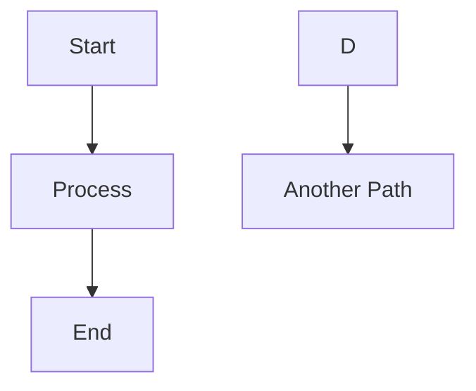

Imagine a world where writing for the web was as simple as writing a note to a friend. That's the promise that Markdown made to us, and it's a promise that changed how we think about content creation on the internet.

Think of Markdown as a bridge between the human mind and the digital world. It's like having a conversation with your computer in a language that feels natural to us humans. When you write in Markdown, you're not wrestling with complex HTML tags or formatting commands – you're just writing, plain and simple.

But here's where it gets interesting. Just as languages evolve to meet new needs, Markdown has grown beyond its humble beginnings. It's like watching a city expand from a small town – new features are added, new ways of doing things emerge, and yet the original charm remains.

At the heart of this evolution is something called the "processing pipeline." Think of it as a digital assembly line where your words go through a transformation. Your Markdown text first becomes an abstract representation (called an AST), and then it's turned into beautiful HTML that browsers can display. It's like watching a sculptor transform a block of marble into a work of art.

The magic behind this transformation comes from two powerful tools: Remark and Rehype. They're like the master craftsmen in our digital workshop. Remark handles the Markdown processing, while Rehype works with HTML. Both are built on UnifiedJS, which is essentially the foundation that makes all of this possible.

The journey of your content looks something like this:

1. You write in Markdown (simple, human-friendly)
2. Remark processes it (the first transformation)
3. It becomes an AST (the blueprint)
4. Rehype takes over (the second transformation)
5. Finally, it becomes HTML (the finished product)


Just like there's a standard version of English, there's a standard for Markdown, often referred to as CommonMark. This ensures that basic Markdown written in one place will generally look the same in another.

However, just as languages evolve and develop regional dialects, Markdown has also branched out. Think of GitHub, the massive platform where developers collaborate on software. They needed a few extra features beyond the standard Markdown to make their discussions and documentation even better. So, they created their own "dialect" called GitHub Flavored Markdown (GFM). This added things like the ability to easily create checkboxes in lists or automatically link to other users and projects. GFM is incredibly popular and has become a standard in its own right across many platforms.

But the story doesn't end there. What if you wanted to do even more with your writing? What if you wanted to embed interactive charts or even run small pieces of code directly within your Markdown? That's where things get really interesting with technologies like MDX.

MDX is like taking the familiar comfort of Markdown and injecting it with the power of a full programming language, in this case, JavaScript. It's a "superset" of Markdown, meaning anything that works in standard Markdown also works in MDX, but MDX lets you do so much more. Imagine being able to write a blog post and directly embed a live, interactive graph created with a tool like Mermaid.

Here's a glimpse of how that might work. Let's say you want to visualize a simple process:

````

````

With an MDX plugin, instead of just seeing the raw code, this gets transformed into a beautifully rendered diagram right there in your document. It's like bringing your ideas to life in a more dynamic way.

Similarly, imagine wanting to seamlessly include a PDF document within your writing. With a custom MDX extension, you could potentially do something as simple as:

```
[!PDF](./test.pdf)
```

And the reader would see the PDF embedded directly in the page.

The true power of MDX lies in its extensibility through plugins. You can create custom plugins to extend Markdown's capabilities by adding support for domain-specific languages and syntax. These plugins can transform your custom syntax into rendered output or process it further as needed. Here are some popular examples from the community:

- Mermaid diagrams for visualizing workflows and architectures
- PlantUML diagrams for modeling software systems
- LaTeX-style mathematical equations and formulas
- Interactive React components that let readers experiment with code examples directly in documentation

Each plugin adds a new dimension to your documentation while maintaining Markdown's simple, readable syntax. This extensibility has made MDX particularly popular in technical documentation, where complex concepts often benefit from interactive demonstrations and visual aids.

The beauty of this whole system lies in its modularity. If you want to add a new feature to Markdown, you don't have to rewrite everything from scratch. You can simply create a plugin for Remark or Rehype that understands your new syntax and knows how to transform it into the desired output. It's like adding a new tool to your workshop – it enhances your capabilities without requiring you to rebuild the entire workshop.

This is just the beginning of our journey into the world of MDX. In the following posts, we'll explore:

- [GitHub Flavored Markdown Guide](/blog/2025/2024-01-01-gfm)
- [Build a documentation site with Next.js and MDX](/blog/2025/2025-01-13-nextjs-mdx)
- [ContentLayer](/blog/2025/2025-02-28-contentlayer-mdx)
- [MDX Open Source](/blog/2025/DRAFT/2025-03-12-mdx-opensource)
- [MDX Internal](/blog/2025/DRAFT/2025-03-12-mdx-internal)

From its humble beginnings as a simple way to format text, Markdown has evolved into a powerful platform for creating and sharing information. It's a reminder that sometimes, the most impactful innovations are the ones that are easy to use, understand, and extend. And the story of Markdown and its extensions like MDX is still being written, with new possibilities emerging all the time.

### Open Source Projects on MDX

[next-mdx-remote](https://github.com/hashicorp/next-mdx-remote)

[next-mdx-blog](https://github.com/hashicorp/next-mdx-blog)

[next-mdx-blog-template](https://github.com/hashicorp/next-mdx-blog-template)
