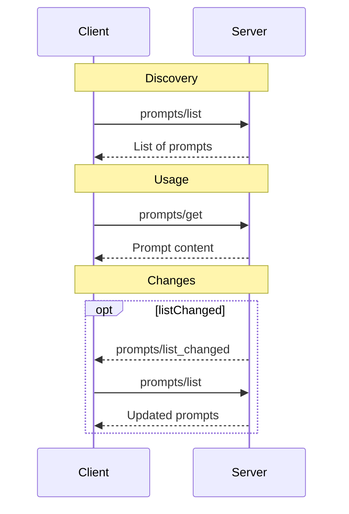

MCP 协议提供 stdio IPC 和 SSE 两种传输方式。

核心提供两个 JSON rpc 函数:

- listTools
- callTool

* Resource
* tools
* Prompts: more like a tempalted string prompt, but leave it to the server to decide how to use it.

why separate resource from tools?

In general, resource and tools different like http verb semantics. Resource is more like a static content, while tool is more like a function call.

These 3 components are common in a comman LLM applicaiton, and sicne when we develop LLM applicaitons, we spend most of the time tuning these components, it is important to have a standard way to specify them.

so MCP abstract these components and provide a interface for developers to customize them.

This is typical LLM centeric perspective, but it is not the only perspective.

Background

LLM can generate function call, but it is not enough.

You as a developer, need to tell LLM the specification of the functions available. .

Then you decide how to interpret the function call, and how to implement the function.

So it is ad-hoc and not scalable.

There is need to have a standard way to specify the function call and the function implementation.

Here comes MCP.

MCP is like USB for computer.

Since for general agent, it is not possible to know the function call in advance.  
We need a way for agent to discover the externl pools of tools.
The agent can utilize a way to find if there are appropriate tools for the task.
and then the agent knows hwo to call the tools by following a standard protocol.

Knowing this, the agent will be able to use a lot of tools.

## Introduction

## Hello World

This hello world project wraps Flomoapp API in a MCP server.
See [mcp-server-flomo](https://github.com/camel-ai/mcp-hello-world) for more details.

## Specification

Client
Server

service discovery

service call

Authentication

### Prompts



- `prompts/list`
- `prompts/get`
- `prompts/list_changed`

it seems `prompts/list_changed` is not as useful as the other two. Implementations of the protocol may do not know when to nofity the client.

since the change can happen at any time, it is not possible to know when to notify the client.

## Popular libraries

- MCP client for browser use
- MCP client for code sandbox
- MCP client for mobile use
- MCP client for server use
- MCP client for Desktop use

## MCP in the wild

MCP for 3D Blender

[🦉 OWL: Optimized Workforce Learning for General Multi-Agent Assistance in Real-World Task Automation](https://github.com/camel-ai/owl)
🦉 OWL: Optimized Workforce Learning for General Multi-Agent Assistance in Real-World Task Automation

MCP as a high level protocol, should not care about the underlying transport layer.
From this perspective, the design of MCP is very cubersome.

As a high level protocol, MCP should support streaming transport and bi-directional streaming. So there is no need to care about request/response or uni-directional notification.

What is JSON-RPC? how it related to HTTP or TCP?

https://glama.ai/chat

MCP 貌似就是 tools 的一个包装， 所以 MCP 的价值是什么

基本流程，

1. 在 client 端配置好 MCP server 的地址（或者python/js 的脚步）
2. client 调用 mcp listTools 获取对应 server 的工具列表
3. client 在调用LLM 时， 将对应 tools 的描述作为 prompt 的一部分发送给 LLM
4. LLM 在生成 response 时， 根据 response 的格式， 调用对应的工具
5. client 检查 LLM 的 response， 完成tool call 的调用
6. 将 tool call 的执行结果返回给 LLM
7. LLM 根据 tool call 的执行结果， 生成最终的 response

从这个流程来看， MCP 就是封装了了 list tools 的流程， 对于服务提供商来说， 实现 MCP 的一个 list tools 工具， 而具体的工具调用，可以基于 IPC 或者 HTTP Rest API 来实现。

非说价值， 更多是使用方便， 因为这样很多聊天客户端就可以通过支持 MCP 来支持各种工具调用，而不用客户端开发者内置各种工具调用。

当然，其实可以再加一个服务发现的接口， 就是客户端将需求发送给 MCP server， 然后 MCP server 返回合适的工具列表。（默认情况下， MCP server 会返回所有工具列表） 高级实现可以基于 LLM 来实现。

TODO:

- write a annotation style framework for MCP server in Typescript

for example:
This expose tools like Rest API route.

```typescript
@mcp.tool()
@mcp.stdio
@mcp.http
export function myTool(input: string) {
    return "Hello, world!";
}
```

### Node module Resolution

```mermaid
graph TD
    A[Module Specifier] --> B{Core Module?};
    B -- Yes --> C[Load Core Module];
    B -- No --> D{Relative Path?};
    D -- Yes --> E[Resolve Relative Path];
    D -- No --> F[Search node_modules];
    E --> G{Directory?};
    G -- Yes --> H[Check package.json "main"];
    H --> I[Load Entry Point];
    G -- No --> I[Load Entry Point];
    E --> J[Append Extensions (.js, .json, .node)];
    J --> I[Load Entry Point];
    F --> K{Found in node_modules?};
    K -- Yes --> L{package.json "exports" field?};
    L -- Yes --> M[Resolve using exports field];
    L-- No --> H;
    M --> I[Load Entry Point];
    K -- No --> N[Move to Parent node_modules];
    N --> F;
    I[Load Entry Point] --> O[Module Loaded];
    C --> O[Module Loaded];
```

### mcp-get

What mcp-get does is quite simple.
Whoever wants to publish a mcp-server tool to be used by Claude, can submit a PR to add the tool to the list.
For example https://github.com/michaellatman/mcp-get/pull/101/files
this PR adds a tool `mcp-server-flomo` to the package list.

On every PR, the github action will automatically bump `mcp-get` to the next version, containing the updated [package list](https://github.com/michaellatman/mcp-get/tree/main/packages).

Now, as long as the PR is merged, you can find the page at https://mcp-get.com/packages/mcp-server-flomo.
In the same time, in the terminal, you can use `npx @michaellatman/mcp-get@latest install mcp-server-flomo` to install the tool for Claude Desktop.

mcp-get is more a client side installation tool with limited registry management capabilities.

### Smithery.ai

Smithery.ai is a similar tool to mcp-get, but it can provide a cloud service to host simple mcp-server, acting like a proxy between the client and the tool provider.

For example, I deploy the `mcp-server-flomo` on Smithery.ai, and then you can find it at https://smithery.ai/server/@xianminx/mcp-server-flomo.

```json
{
  "mcpServers": {
    "mcp-server-flomo": {
      "command": "npx",
      "args": [
        "-y",
        "@smithery/cli@latest",
        "run",
        "@xianminx/mcp-server-flomo",
        "--key",
        "your-smithery-key-here"
      ]
    }
  }
}
```

This will use Smithery.ai to host the `mcp-server-flomo` and use it as a proxy server for the tool.

### composio.dev

https://mcp.composio.dev/

### Cursor

https://docs.cursor.com/context/model-context-protocol#model-context-protocol

- stdio
- sse
- tools
- resources (not supported yet)

- Architecture

- Configuration
  can be specified in the `mcp.json` file, project root or user home directory.

使用 stdio 时， 不能轻易使用 console.log 来输出信息， 因为 stdio 的输出会被截断。

- Protocol
  - connect
  - notification
  - setRequestHandler
  - setNotificationHandler
