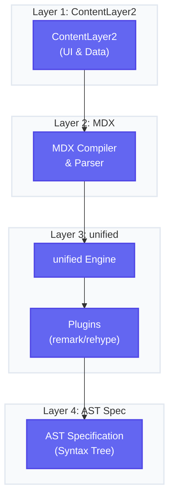

## unifiedjs

unifiedjs is a platform for building modular content pipelines.
It provides a core interface for parsing, transforming, and serializing content.

- unifiedjs
  - ast: mdast, hast, xast etc.
  - build tools: remark, rehype, remark-rehype, rehype-remark

### AST

text string is parsed into an abstract syntax tree (AST). So unstructured text is transformed into structured data and now logic code with rules can be applied to the text.

Later on, we can code plugins to transform the AST into another AST, to yet another AST, and finally, to the target format.

Since the AST is a tree structure, we can build a tree based library to transform the AST, and this is unist.
The core action on tree is `visit`, which is a recursive function that traverses the tree and applies a function to each node.

### remark

remark is a markdown processor powered by plugins.

### rehype

rehype is a html processor powered by plugins.

If you are interested in how markdown source text is transformed into a static html page, I highly recommend you to read this article https://unifiedjs.com/learn/guide/using-unified/.

