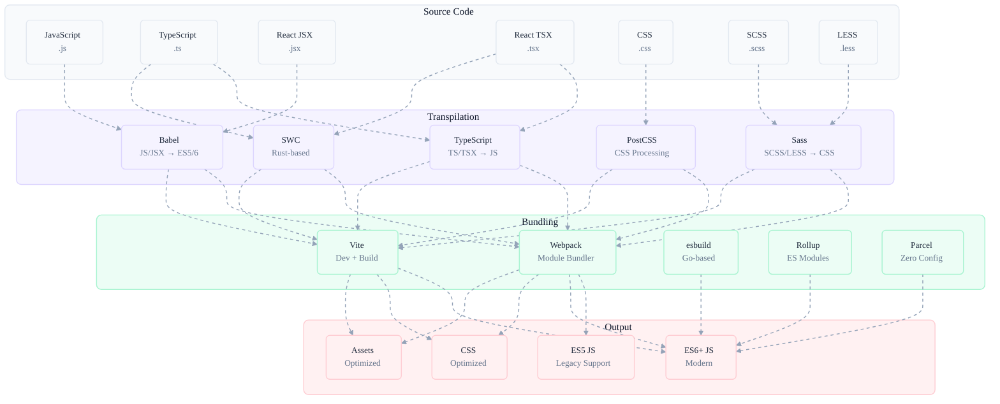

## Layered Anatomy

```mermaid
%%{init: {
  'theme': 'base',
  'themeVariables': {
    'fontFamily': 'SF Pro Display, Inter, system-ui, -apple-system',
    'fontSize': '16px',
    'fontWeight': '500',
    'lineColor': '#94a3b8',
    'primaryColor': '#4f46e5',
    'primaryTextColor': '#1e293b',
    'primaryBorderColor': '#e2e8f0',
    'secondaryColor': '#f1f5f9',
    'tertiaryColor': '#f8fafc',
    'noteTextColor': '#475569',
    'ganttFontSize': '16px'
  }
}}%%

graph TB
    %% Define node styles
    classDef default font-weight:500,font-size:14px;

    %% Define subgraph styles with fixed width and left alignment
    classDef subgraphStyle width:400px,text-align:left,margin:0;

    subgraph SRC["Source Code"]
        direction LR
        JS["JavaScript<br/><span style='font-size:12px;color:#64748b'>.js</span>"]
        TS["TypeScript<br/><span style='font-size:12px;color:#64748b'>.ts</span>"]
        JSX["React JSX<br/><span style='font-size:12px;color:#64748b'>.jsx</span>"]
        TSX["React TSX<br/><span style='font-size:12px;color:#64748b'>.tsx</span>"]
        CSS["CSS<br/><span style='font-size:12px;color:#64748b'>.css</span>"]
        SCSS["SCSS<br/><span style='font-size:12px;color:#64748b'>.scss</span>"]
        LESS["LESS<br/><span style='font-size:12px;color:#64748b'>.less</span>"]
    end

    subgraph TRANS["Transpilation"]
        direction LR
        BABEL["Babel<br/><span style='font-size:12px;color:#64748b'>JS/JSX → ES5/6</span>"]
        SWC["SWC<br/><span style='font-size:12px;color:#64748b'>Rust-based</span>"]
        TSC["TypeScript<br/><span style='font-size:12px;color:#64748b'>TS/TSX → JS</span>"]
        POSTCSS["PostCSS<br/><span style='font-size:12px;color:#64748b'>CSS Processing</span>"]
        SASS["Sass<br/><span style='font-size:12px;color:#64748b'>SCSS/LESS → CSS</span>"]
    end

    subgraph BUNDLE["Bundling"]
        direction LR
        WEBPACK["Webpack<br/><span style='font-size:12px;color:#64748b'>Module Bundler</span>"]
        VITE["Vite<br/><span style='font-size:12px;color:#64748b'>Dev + Build</span>"]
        ESBUILD["esbuild<br/><span style='font-size:12px;color:#64748b'>Go-based</span>"]
        ROLLUP["Rollup<br/><span style='font-size:12px;color:#64748b'>ES Modules</span>"]
        PARCEL["Parcel<br/><span style='font-size:12px;color:#64748b'>Zero Config</span>"]
    end

    subgraph OUT["Output"]
        direction LR
        ES5["ES5 JS<br/><span style='font-size:12px;color:#64748b'>Legacy Support</span>"]
        ES6["ES6+ JS<br/><span style='font-size:12px;color:#64748b'>Modern</span>"]
        CSSFINAL["CSS<br/><span style='font-size:12px;color:#64748b'>Optimized</span>"]
        ASSETS["Assets<br/><span style='font-size:12px;color:#64748b'>Optimized</span>"]
    end

    %% Apply subgraph styles
    class SRC,TRANS,BUNDLE,OUT subgraphStyle;

    %% Connections with curved edges
    linkStyle default stroke:#94a3b8,stroke-width:1.5px,fill:none,stroke-dasharray:5;

    %% Source to Transpilation
    TS --> TSC
    TSX --> TSC
    JS --> BABEL
    JSX --> BABEL
    TS --> SWC
    TSX --> SWC
    CSS --> POSTCSS
    SCSS --> SASS
    LESS --> SASS

    %% Transpilation to Bundling
    BABEL --> WEBPACK & VITE
    SWC --> WEBPACK & VITE
    TSC --> WEBPACK & VITE
    POSTCSS --> WEBPACK & VITE
    SASS --> WEBPACK & VITE

    %% Bundling to Output
    WEBPACK --> ES5 & ES6 & CSSFINAL & ASSETS
    VITE --> ES6 & CSSFINAL & ASSETS
    ESBUILD --> ES6
    ROLLUP --> ES6
    PARCEL --> ES6

    %% Modern styling with subtle gradients
    classDef sourceLayer fill:#f8fafc,stroke:#e2e8f0,stroke-width:1.5px,rx:6px;
    classDef transpilationLayer fill:#f5f3ff,stroke:#ddd6fe,stroke-width:1.5px,rx:6px;
    classDef bundlingLayer fill:#ecfdf5,stroke:#a7f3d0,stroke-width:1.5px,rx:6px;
    classDef outputLayer fill:#fff1f2,stroke:#fecdd3,stroke-width:1.5px,rx:6px;

    %% Apply styles to nodes
    class JS,TS,JSX,TSX,CSS,SCSS,LESS sourceLayer;
    class BABEL,SWC,TSC,POSTCSS,SASS transpilationLayer;
    class WEBPACK,VITE,ESBUILD,ROLLUP,PARCEL bundlingLayer;
    class ES5,ES6,CSSFINAL,ASSETS outputLayer;

    %% Style subgraphs with left alignment
    style SRC fill:#f8fafc,stroke:#e2e8f0,stroke-width:1.5px,rx:8px,color:#0f172a,text-align:left;
    style TRANS fill:#f5f3ff,stroke:#ddd6fe,stroke-width:1.5px,rx:8px,color:#0f172a,text-align:left;
    style BUNDLE fill:#ecfdf5,stroke:#a7f3d0,stroke-width:1.5px,rx:8px,color:#0f172a,text-align:left;
    style OUT fill:#fff1f2,stroke:#fecdd3,stroke-width:1.5px,rx:8px,color:#0f172a,text-align:left;
```

Compiler: ts -> js, jsx/ tsx -> js,  
Bundler: webpack, vite, etc.
Transpiler: babel, etc.
