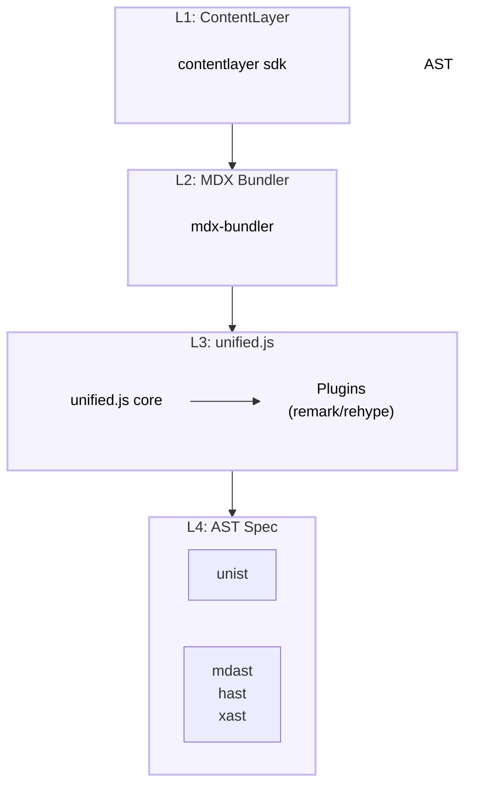

<MdxSeriesNav currentPost={props.path} />

## What is ContentLayer?

The workflow

1. mdx transforms to json
2. json converts to react components
3. react components render to html

Next.js uses webpack to compile and bundle the project.
ContentLayer, as a plugin, is used by next.js to process the mdx files and generate the json files. This is configured in `next.config.js`:

```javascript
import { withContentlayer } from 'next-contentlayer2'

const config = () => {
  const plugins = [withContentlayer, withBundleAnalyzer]
  return plugins.reduce((acc, next) => next(acc), {
    output,
    basePath,
    reactStrictMode: true,
    pageExtensions: ['ts', 'tsx', 'js', 'jsx', 'md', 'mdx'],
    eslint: {
        ...

```

The `withContentlayer` function is a plugin that processes the mdx files and generates the json files. The json files are then used by the React components to render the content.

Then ContentLayer as plugin, use contentlayer sdk to scan and find all md(x) files in the project, then transform them to json files.
the json files has frontmatter and body, frontmatter is the metadata of the md(x) file, body is the content of the md(x) file.
the body has `raw` and `code`
the raw field is the raw text of the content of mdx file. and the code the transformed react of the mdx file, make it possible to render the mdx file as react component. so you can embed custom react compoentn inside mdx file.

Sample json file:

```json
{
  "title": "MDX Using file based routing",
  "date": "2024-01-02T00:00:00.000Z",
  "tags": [
    "markdown",
    "github",
    "gfm",
    "mdx"
  ],
  "draft": true,
  "summary": "A demo to show using file based routing for mdx, just like regular app routing page.tsx in Next.js.",
  "authors": [
    "Lucas"
  ],
  "body": {
    "raw": "\n{/* \nimport {\n  default as ChildMDX,\n  ... actions.",
    "code": "var Component=(()=>{ ... return Component;"
  },
  ...
  "type": "Blog",
  "slug": "2025/2025-01-02-childmdx",
  "path": "blog/2025/2025-01-02-childmdx",
  "filePath": "blog/2025/2025-01-02-childmdx.mdx",
  ...
  }
```

You can customize how contentlayer transform the mdx file to json file by using `contentlayer.config.js` file.
The core function to transform the mdx file to json file is `makeSource` function.

```javascript
export default makeSource({
  contentDirPath: 'data',
  documentTypes: [Blog, Authors],
  mdx: {
    cwd: process.cwd(),
    remarkPlugins: [
      remarkExtractFrontmatter,
      remarkGfm,
      remarkCodeTitles,
      remarkMath,
      remarkImgToJsx,
      remarkAlert,
    ],
    rehypePlugins: [
      rehypeSlug,
      [
        rehypeAutolinkHeadings,
        {
          behavior: 'prepend',
          headingProperties: {
            className: ['content-header'],
          },
          content: icon,
        },
      ],
      rehypeKatex,
      rehypeKatexNoTranslate,
      [rehypeCitation, { path: path.join(root, 'data') }],
      [rehypePrismPlus, { defaultLanguage: 'js', ignoreMissing: true }],
      rehypePresetMinify,
    ],
  },
  onSuccess: async (importData) => {
    const { allBlogs } = await importData()
    createTagCount(allBlogs)
    createSearchIndex(allBlogs)
  },
})
```

When ContentLayer sdk transform the mdx file to json file, it will use the remark and rehype plugins to process the mdx file.

Then in `/app/blog/[...slug]/page.tsx` file, the json file is imported and used to render the content.

```javascript
<MDXLayoutRenderer code={post.body.code} components={components} toc={post.toc} />
```

`MDXLayoutRenderer` is a util component from `pliny` lib that render the generated code as react component.

- `code` is the transformed react component of the mdx file.
- `components` is the custom components that can be used in the mdx file.
- `toc` is the table of content of the mdx file.

So if the mdx uses custom components, the `components` prop should be passed to the `MDXLayoutRenderer` component.

Register custom components in `/components/MDXComponents.tsx` file.

```javascript
import { HelloMDX } from './HelloMDX'

export const components: MDXComponents = {

  HelloMDX,
}
```

Contentlayer is a content processing SDK that transforms your MDX files into type-safe JSON data, enabling seamless integration into your application. This transformation allows you to import MDX content as structured data, with the `body.code` field containing the React component representation of the MDX content.

**Input:**

The input to Contentlayer is your MDX files, which may include frontmatter and content. For example:

```mdx
---
title: 'Sample Post'
date: '2025-02-27'
---

# Hello, World!

This is a sample MDX post.
```

**Output:**

Contentlayer processes these MDX files and outputs JSON objects with the following structure:

```json
{
  "title": "Sample Post",
  "date": "2025-02-27",
  "body": {
    "raw": "MDX content as raw string",
    "code": "React component code representing the MDX content"
  },
  "_id": "path/to/sample-post.mdx",
  "_raw": {
    "sourceFilePath": "path/to/sample-post.mdx",
    "sourceFileName": "sample-post.mdx",
    "contentType": "mdx",
    "flattenedPath": "path/to/sample-post"
  },
  "type": "Post"
}
```

In this output:

- `title` and `date` are extracted from the frontmatter.
- `body.raw` contains the raw MDX content.
- `body.code` contains the React component code representing the MDX content.
- `_id` is a unique identifier for the document.
- `_raw` contains metadata about the source file.
- `type` indicates the document type.

**Converting a Single File Using the Command Line:**

Contentlayer primarily operates during the build process of your application, processing all specified content files. It doesn't natively provide a command-line interface (CLI) for processing individual files outside of the build process.

However, you can achieve similar functionality by setting up a custom script that processes a single MDX file. Here's how you can do it:

1. **Set Up Contentlayer Configuration:**

   Ensure your `contentlayer.config.ts` is properly configured to process your MDX files. For example:

   ```typescript
   // contentlayer.config.ts
   import { defineDocumentType, makeSource } from 'contentlayer/source-files'

   const Post = defineDocumentType(() => ({
     name: 'Post',
     filePathPattern: '**/*.mdx',
     contentType: 'mdx',
     fields: {
       title: { type: 'string', required: true },
       date: { type: 'date', required: true },
     },
     computedFields: {
       url: { type: 'string', resolve: (doc) => `/posts/${doc._raw.flattenedPath}` },
     },
   }))

   export default makeSource({
     contentDirPath: 'content',
     documentTypes: [Post],
   })
   ```

2. **Create a Custom Script:**

   Create a Node.js script that imports and processes a single MDX file using Contentlayer's internal APIs. For example:

   ```javascript
   // processMdx.js
   const { makeSource } = require('contentlayer/source-files')
   const fs = require('fs')
   const path = require('path')

   // Initialize Contentlayer source
   const source = makeSource({
     contentDirPath: 'content',
     documentTypes: [], // Specify your document types here
   })

   // Process a single MDX file
   const processMdxFile = async (filePath) => {
     const fileContent = fs.readFileSync(filePath, 'utf-8')
     const processedContent = await source.process(fileContent)
     console.log(processedContent)
   }

   // Specify the path to your MDX file
   const mdxFilePath = path.resolve(__dirname, 'content/path/to/your/file.mdx')
   processMdxFile(mdxFilePath)
   ```

3. **Run the Script:**

   Execute the script using Node.js:

   ```bash
   node processMdx.js
   ```

This script reads the specified MDX file, processes it using Contentlayer, and outputs the processed content. You can modify the script to handle the output as needed, such as saving it to a JSON file or logging it to the console.

**Note:**

While this approach allows you to process individual MDX files, it's not the primary use case for Contentlayer. Contentlayer is designed to process all specified content files during the build process, integrating them into your application seamlessly.

For more detailed information on processing MDX files with Contentlayer, refer to the official documentation. citeturn0search1

ContentLayer2 transform mdx files at compile time, use

1. Builds a AST on the mdx file.
2. Use the AST to generate a JSON file.
3. Use components defined in `MDXComponents.tsx` file to transform custom markdown element to react component.
   For example, contentlayer2 use pliny to render code block to `pre` tag, and map it to `Pre` React component, so it renders in a more elegant and can copy and past code block.
   The source file from pliny to render `pre` is at
   https://github.com/timlrx/pliny/blob/main/packages/pliny/src/ui/Pre.tsx .
   The react componnet just add a wrapper `div` out of `pre` tag, and add a button to copy code when mouse hover the code block.

```tsx
import { useState, useRef, ReactNode } from 'react'

const Pre = ({ children }: { children: ReactNode }) => {
  const textInput = useRef(null)
  const [hovered, setHovered] = useState(false)
  const [copied, setCopied] = useState(false)

  const onEnter = () => {
    setHovered(true)
  }
  const onExit = () => {
    setHovered(false)
    setCopied(false)
  }
  const onCopy = () => {
    setCopied(true)
    navigator.clipboard.writeText(textInput.current.textContent)
    setTimeout(() => {
      setCopied(false)
    }, 2000)
  }

  return (
    <div ref={textInput} onMouseEnter={onEnter} onMouseLeave={onExit} className="relative">
      {hovered && (
        <button
          aria-label="Copy code"
          className={`absolute right-2 top-2 h-8 w-8 rounded border-2 bg-gray-700 p-1 dark:bg-gray-800 ${
            copied
              ? 'border-green-400 focus:border-green-400 focus:outline-none'
              : 'border-gray-300'
          }`}
          onClick={onCopy}
        >
          <svg
            xmlns="http://www.w3.org/2000/svg"
            viewBox="0 0 24 24"
            stroke="currentColor"
            fill="none"
            className={copied ? 'text-green-400' : 'text-gray-300'}
          >
            {copied ? (
              <>
                <path
                  strokeLinecap="round"
                  strokeLinejoin="round"
                  strokeWidth={2}
                  d="M9 5H7a2 2 0 00-2 2v12a2 2 0 002 2h10a2 2 0 002-2V7a2 2 0 00-2-2h-2M9 5a2 2 0 002 2h2a2 2 0 002-2M9 5a2 2 0 012-2h2a2 2 0 012 2m-6 9l2 2 4-4"
                />
              </>
            ) : (
              <>
                <path
                  strokeLinecap="round"
                  strokeLinejoin="round"
                  strokeWidth={2}
                  d="M9 5H7a2 2 0 00-2 2v12a2 2 0 002 2h10a2 2 0 002-2V7a2 2 0 00-2-2h-2M9 5a2 2 0 002 2h2a2 2 0 002-2M9 5a2 2 0 012-2h2a2 2 0 012 2"
                />
              </>
            )}
          </svg>
        </button>
      )}

      <pre>{children}</pre>
    </div>
  )
}

export default Pre
```

The code block itself is still rendered by highlight js.

3. Use the JSON file to generate a component.

those custom components then are used by `MDXLayoutRenderer` in `/app/blog/[...slug]/page.tsx` as

```tsx
<MDXLayoutRenderer code={post.body.code} components={components} toc={post.toc} />
```

The transformation process happens in several steps:
MDX Parsing: Your MDX content is first parsed into an Abstract Syntax Tree (AST)
Remark Plugins: The AST goes through remark plugins:
remarkGfm - Adds GitHub Flavored Markdown support
remarkCodeTitles - Handles code block titles
And others for math, frontmatter, etc.
Rehype Plugins: Then it goes through rehype plugins that transform the AST to HTML/JSX:
rehypePrismPlus - This is the key plugin that's transforming your code blocks into syntax-highlighted JSX elements
Other plugins for headings, math, minification, etc.
Final Compilation: The processed content is compiled into the React components you're seeing in the output, where each part of the code block is wrapped in spans with appropriate classes for syntax highlighting.
Let's modify the configuration to better handle Mermaid blocks. We'll update both the ContentLayer config and the MDX components:

Ah, let me explain the relationship between code and pre components in MDX/Markdown processing:
In Markdown/MDX, when you write a code block like this:
`
It gets transformed into HTML/JSX structure like this:

>

In your MDX setup:

- The pre component handles the outer wrapper (`<pre>`) tag
- The code component handles the inner content (`<code>`) tag
- Both are registered in your MDXComponents for custom handling

Have you ever wondered how a simple markdown file transforms into a beautiful webpage? It's like watching a caterpillar become a butterfly – a seemingly magical process that, when you look closer, reveals an elegant system of transformation. This is the story of unifiedjs, a platform that makes this metamorphosis possible.

## The Power of Abstraction

In the world of content creation, we often find ourselves dealing with raw text – unstructured, formless, and difficult to manipulate. It's like having a pile of building blocks without a blueprint. This is where unifiedjs steps in, offering us a way to transform this raw material into something structured and meaningful.

The magic begins with something called an Abstract Syntax Tree, or AST for short. Think of it as a map that shows how different pieces of content relate to each other. Just as a city map helps us understand how streets connect and buildings are arranged, an AST helps us understand how words, paragraphs, and other elements connect to form our content.

## The Tree of Knowledge

The beauty of this approach lies in its simplicity. unifiedjs provides us with a core interface – a set of fundamental tools that let us parse, transform, and serialize content. It's like having a universal translator that can convert content between different formats while maintaining its meaning.

At the heart of this system are two powerful tools: remark and rehype. Remark is our markdown processor, the one that takes our plain text and gives it structure. Rehype, on the other hand, is our HTML processor, the one that transforms this structured content into beautiful web pages.

## The Art of Transformation

What makes unifiedjs truly fascinating is its plugin-based architecture. Think of it as a modular workshop where each tool has a specific purpose. You can add or remove tools as needed, creating your own unique content processing pipeline. It's like having a Swiss Army knife where you can add new tools to handle different tasks.

The process is elegant in its simplicity:

1. Take raw content
2. Transform it into a structured format (AST)
3. Apply various transformations through plugins
4. Convert it into the final desired format

This approach is not just about processing content – it's about understanding it. By breaking down content into a structured format, we can apply logic and rules to transform it in ways that would be impossible with raw text.

## The Journey of Content

Let me show you how this works in practice. When you write a markdown file, it starts as simple text. unifiedjs takes this text and creates a map (AST) of how everything fits together. Then, through a series of transformations (using plugins), this map is gradually transformed into the final HTML that appears on your website.

It's like watching a sculptor work with clay. First, they have a rough block of material (raw text). Then they create a basic structure (AST). Finally, they refine and shape it (transformations) until it becomes the finished piece (HTML).

## The Power of Understanding

What makes unifiedjs special isn't just its technical capabilities – it's the way it helps us understand and manipulate content. By providing a structured way to work with content, it opens up possibilities that would be difficult or impossible to achieve otherwise.

If you're interested in diving deeper into how this transformation works, I highly recommend reading the unifiedjs guide. It's like having a backstage pass to watch the magic happen.


