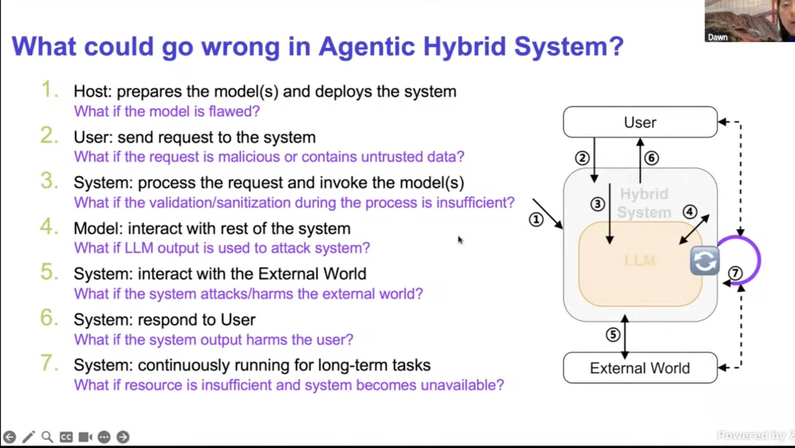

## Table of Contents

1. **Overview of Agentic AI Safety & Security**
2. **Attacks in Agentic AI**
3. **Evaluation & Risk Assessment**
4. **Defense Mechanisms**

## 1. Key Concepts

**Safety vs. Security:**

- Different definitions
- Different research focuses
- LLM safety vs. Agent safety

**Agentic System Interaction Model:**

- System components
- Interaction flows
- Potential harm points

## 2. Security Framework

**C.I.A Framework Application:**

- **Confidentiality:** Protecting private data
- **Integrity:** Ensuring accurate operations
- **Availability:** Maintaining service access

**Security Level Classification:**

- 5 model security levels (0-4)
- Measured by: Accuracy & Vulnerability
- Higher number = Lower security

## 3. Attack Vectors

**Common Attack Types:**

- SQL injection via LLM
- Remote Code Execution (RCE)

**Prompt Injection Methods:**

- **Heuristic-based:**
  - Naive injection
  - Escape characters
  - Context ignoring
  - Fake completion
- **Optimization-based**

**Injection Examples:**

- Direct prompt injection
- Indirect prompt injection

## 4. Threat Modeling

**AgentXploit Framework:**

- Comprehensive threat model
- Black-box AI agent testing
- End-to-end redteaming approach

## 5. Defense Principles

**Core Security Concepts:**

- Defense in depth
- Least privilege
- Privilege separation
- Secure-by-design approach

**Implementation Examples:**

- Progent: Programmable privilege control
- Attack chain disruption strategies

## 6. Key Research Papers

- Privtrans: Automated privilege separation
- DataSentinel: Game-theoretic injection detection
- AgentPoison: Memory/knowledge base attacks
- Progent: Privilege control for LLM agents
- [Safe & Trustworthy AI Agents](https://rdi.berkeley.edu/llm-agents/assets/dawn-agent-safety.pdf)
